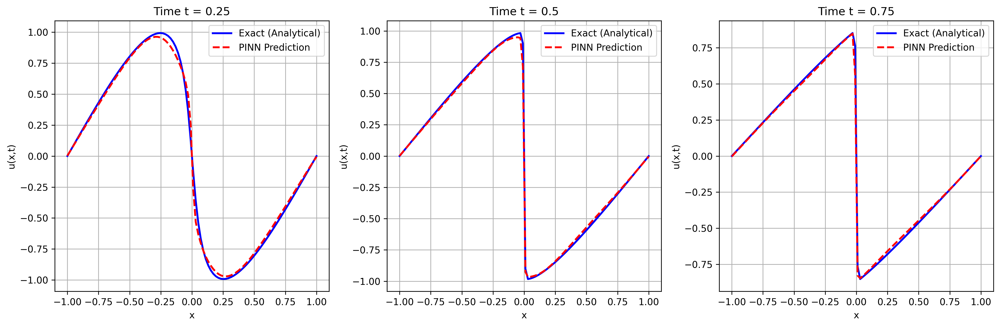

# Problem 1: Solving the 1D Burgers' Equation with PINNs

This folder contains the PyTorch implementation of a Physics-Informed Neural Network (PINN) designed to solve the 1D Burgers' equation. 

## 📌 Problem Formulation

The **1D Burgers' Equation** is a fundamental partial differential equation (PDE) in fluid mechanics and gas dynamics. It models the interaction between non-linear convection (which steepens waves) and diffusion (which smears them). It is notorious for developing sharp shockwaves, making it a classic benchmark for numerical solvers.

**Governing Equation:**
$$\frac{\partial u}{\partial t} + u \frac{\partial u}{\partial x} = \nu \frac{\partial^2 u}{\partial x^2}$$
Where:
* $u(x,t)$ is the fluid velocity.
* $\nu = 0.01 / \pi$ is the kinematic viscosity.

**Conditions:**
* **Domain:** $x \in [-1, 1]$, $t \in [0, 1]$
* **Initial Condition (IC):** $u(x, 0) = -\sin(\pi x)$
* **Boundary Conditions (BC):** $u(-1, t) = u(1, t) = 0$

---

## 🧠 Neural Network Architecture & Justification

The neural network acts as a universal function approximator: $u_{\theta}(x, t) \approx u(x, t)$, where $\theta$ represents the weights and biases.

### 1. Layers & Dimensions
* **Input Layer:** 2 neurons ($x$ and $t$)
* **Hidden Layers:** 8 layers with 20 neurons each.
* **Output Layer:** 1 neuron ($u$).
* **Why this size?** PINNs require sufficient capacity to map complex non-linear physics. Shallow networks struggle to capture the sharp gradient of the shockwave at $x=0$, while excessively wide/deep networks are prone to overfitting and slow convergence. The [2, 20x8, 1] architecture is a proven standard in PINN literature (Raissi et al., 2019) that balances expressiveness with computational efficiency.

### 2. Activation Function: `Tanh`
* In standard deep learning, `ReLU` is the default. However, **`ReLU` is strictly avoided in PINNs** for PDEs involving second-order derivatives (like $\frac{\partial^2 u}{\partial x^2}$).
* The second derivative of a `ReLU` function is zero everywhere (and undefined at the origin). If we used `ReLU`, the physics residual for the diffusion term ($\nu u_{xx}$) would vanish, and the network would fail to learn the physics. 
* **`Tanh`** is infinitely differentiable, providing the smooth, continuous gradients necessary for `torch.autograd` to compute $u_x$, $u_t$, and $u_{xx}$ accurately.

---

## 📉 Loss Function & Training Dynamics

PINNs do not require a massive dataset of labeled interior points. Instead, they learn by minimizing a composite loss function:
$$\mathcal{L}_{Total} = \mathcal{L}_{Data} + \mathcal{L}_{Physics}$$

### 1. Data Loss ($\mathcal{L}_{Data}$)
Ensures the network respects the boundaries and the starting state:
$$\mathcal{L}_{Data} = \frac{1}{N_u} \sum_{i=1}^{N_u} |u_{\theta}(x_i, t_i) - u_{true}(x_i, t_i)|^2$$
(Evaluated only at $t=0$ and $x=\pm 1$).

### 2. Physics Loss ($\mathcal{L}_{Physics}$)
Ensures the network obeys the fluid dynamics inside the domain. Using `torch.autograd`, we compute the derivatives and define the PDE residual $f$:
$$f = \frac{\partial u_{\theta}}{\partial t} + u_{\theta} \frac{\partial u_{\theta}}{\partial x} - \nu \frac{\partial^2 u_{\theta}}{\partial x^2}$$
$$\mathcal{L}_{Physics} = \frac{1}{N_f} \sum_{i=1}^{N_f} |f(x_i, t_i)|^2$$
(Evaluated at 10,000 randomly sampled collocation points inside the domain).

### 3. Optimizer and Epochs
* **Optimizer:** `Adam` (Adaptive Moment Estimation) with a learning rate of $1 \times 10^{-3}$. PINN loss landscapes are highly non-convex due to the competing gradients of the data loss and physics loss. Adam efficiently navigates this landscape.
* **Epochs (5000):** Unlike standard classification tasks, physics residuals converge slowly. 5000 epochs ensure the residual loss drops sufficiently low (typically $< 10^{-4}$) to capture the sharp discontinuity of the shockwave accurately.

---

## 🧮 Analytical Validation (Cole-Hopf Transformation)

To prove the PINN learned the correct physics, we compare its output against the exact mathematical solution. The non-linear Burgers' equation can be transformed into the linear Heat Equation using the **Cole-Hopf transformation**:
$$u = -2\nu \frac{1}{\phi} \frac{\partial \phi}{\partial x}$$

Applying this, the exact solution is given by the integral:
$$u(x,t) = \frac{\int_{-\infty}^{\infty} \frac{x-\eta}{t} \exp\left( -\frac{(x-\eta)^2}{4\nu t} - \frac{1}{2\pi\nu}[1 - \cos(\pi\eta)] \right) d\eta}{\int_{-\infty}^{\infty} \exp\left( -\frac{(x-\eta)^2}{4\nu t} - \frac{1}{2\pi\nu}[1 - \cos(\pi\eta)] \right) d\eta}$$

### The "Stiff Equation" Advantage of PINNs
Calculating this exact integral numerically is notoriously difficult. Because our viscosity is so small ($\nu \approx 0.00318$), the exponent becomes a massive negative/positive number, causing standard integrators (like `scipy.integrate.quad`) to fail due to **numerical overflow** and missed mathematical spikes.

To compute the blue line in our results, we had to use a highly dense, 100,000-point discrete grid and apply the **Log-Sum-Exp trick** to prevent the computer from crashing. **The PINN, remarkably, bypassed this numerical instability entirely, learning the shockwave smoothly without any integral tricks.**

---

## 📊 Results

The plot below shows the PINN prediction (red dashed line) matching the exact Cole-Hopf analytical solution (blue solid line) at three different time steps.

*As $t$ approaches 0.5 and 0.75, notice how the PINN accurately resolves the steep gradient at $x=0$, effectively capturing the physical shockwave formation.*

## 📚 References
1. Raissi, M., Perdikaris, P., & Karniadakis, G. E. (2019). Physics-informed neural networks: A deep learning framework for solving forward and inverse problems involving nonlinear partial differential equations. *Journal of Computational Physics*, 378, 686-707.
2. Basir, S., & Sen, S. (2023). Physics-Informed Neural Networks (PINNs) for Fluid Mechanics.
