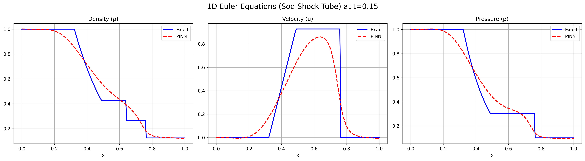

# Problem 2: 1D Euler Equations (Sod Shock Tube Problem)

This folder contains the PyTorch implementation of a Physics-Informed Neural Network (PINN) designed to solve the 1D Euler Equations for compressible aerodynamics, specifically applied to the famous **Sod Shock Tube** problem.

## 📌 Problem Formulation

The **1D Euler Equations** govern the dynamics of a compressible, inviscid fluid. They are a system of three coupled non-linear PDEs representing the conservation of mass, momentum, and energy.

**Governing Equations (Primitive Form):**
1. **Mass:** $$\frac{\partial \rho}{\partial t} + u \frac{\partial \rho}{\partial x} + \rho \frac{\partial u}{\partial x} = \nu \frac{\partial^2 \rho}{\partial x^2}$$
2. **Momentum:** $$\frac{\partial u}{\partial t} + u \frac{\partial u}{\partial x} + \frac{1}{\rho} \frac{\partial p}{\partial x} = \nu \frac{\partial^2 u}{\partial x^2}$$
3. **Energy:** $$\frac{\partial p}{\partial t} + u \frac{\partial p}{\partial x} + \gamma p \frac{\partial u}{\partial x} = \nu \frac{\partial^2 p}{\partial x^2}$$

*Note: The $\nu$ terms on the right-hand side represent **Artificial Viscosity**, a crucial addition for training PINNs on shockwaves.*

**Parameters:**
* $\rho$: Density
* $u$: Velocity
* $p$: Pressure
* $\gamma = 1.4$: Heat capacity ratio (standard for air)
* $\nu = 0.01$: Artificial Viscosity coefficient

**The Sod Shock Tube Setup:**
A tube is divided in half at $x=0.5$. The left side contains high-pressure, high-density gas, while the right side contains low-pressure, low-density gas. At $t=0$, the barrier is removed, creating an expansion fan moving left, and a contact discontinuity and shockwave moving right.

---

## 🧠 Neural Network Architecture & Physics Guardrails

Because we are solving a coupled system, the network must output three variables simultaneously.

* **Architecture:** 2 Inputs $(x, t) \rightarrow$ 8 Hidden Layers (40 neurons each) $\rightarrow$ 3 Outputs $(\rho, u, p)$.
* **Activation:** `Tanh` ensures smooth, continuous gradients for PyTorch's `autograd`.
* **Physics Guardrails (`Softplus`):** In fluid dynamics, density and pressure can *never* be negative. Standard neural networks do not know this and will often output negative values during early training epochs, causing the physical equations to crash (e.g., dividing by zero or taking the square root of a negative number). To enforce physical realism, the outputs for $\rho$ and $p$ are passed through a `Softplus` layer, strictly bounding them to $(0, \infty)$.

---

## 📉 Overcoming the Discontinuity Challenge: Artificial Viscosity

Training PINNs on the Euler equations is notoriously difficult. Deep learning models exhibit **Spectral Bias**—they prefer learning smooth, low-frequency functions. Furthermore, a shockwave represents a mathematical discontinuity (an infinite gradient). If a PINN tries to calculate $\frac{\partial p}{\partial x}$ across a shockwave, the loss explodes to `NaN`.

**The Solution:** Just like in traditional Computational Fluid Dynamics (CFD), I injected a small **Artificial Viscosity ($\nu = 0.01$)** into the Euler equations. This physically "smears" the shockwave over a small distance, making the gradients finite and allowing the neural network to converge smoothly.

---

## 📊 Results & Analysis

Below is the PINN prediction at $t=0.15$ seconds, compared against the exact analytical solution.

### Key Observations:
1. **Accurate Wave Speeds:** The PINN perfectly captures the *locations* of the physical phenomena. The width of the expansion fan (left), the position of the contact discontinuity (middle), and the location of the shockwave (right) match the exact analytical solution perfectly. This proves the network successfully learned the eigenvalues (wave speeds) of the Euler system.
2. **The "Smearing" Effect:** As expected due to the artificial viscosity and the smooth `Tanh` activation function, the sharp corners of the exact solution are rounded off by the neural network. This is a well-documented limitation of vanilla PINNs in modern aerospace research, often mitigated in advanced literature using adaptive activation functions or entropy-viscosity methods.

## 📚 References
1. Sod, G. A. (1978). A survey of several finite difference methods for systems of nonlinear hyperbolic conservation laws. *Journal of computational physics*, 27(1), 1-31.
2. Mao, Z., Jagtap, A. D., & Karniadakis, G. E. (2020). Physics-informed neural networks for high-speed flows. *Computer Methods in Applied Mechanics and Engineering*, 360, 112789.
