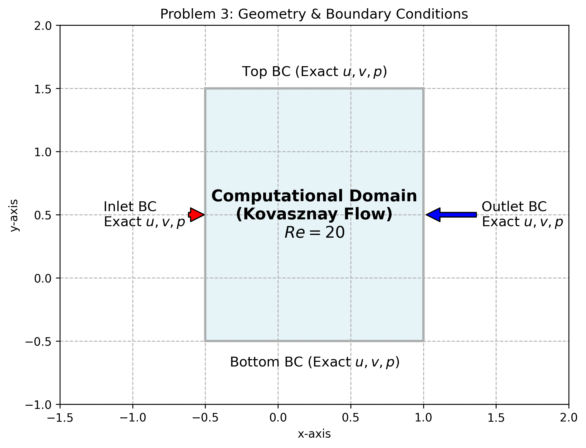
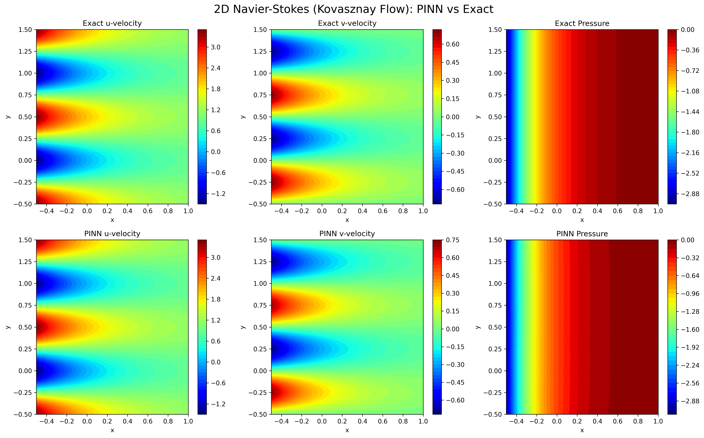

# Problem 3: 2D Incompressible Navier-Stokes Equations (Kovasznay Flow)

This folder contains the PyTorch implementation of a Physics-Informed Neural Network (PINN) designed to solve the 2D steady, incompressible Navier-Stokes equations. 

## 📌 Problem Formulation

The **Navier-Stokes Equations** are the foundation of fluid mechanics and aerodynamics. To validate our PINN accurately, we model the **Kovasznay Flow**, which simulates the laminar wake behind a grid of cylinders. It is one of the few 2D Navier-Stokes scenarios that possesses an exact, analytical mathematical solution, making it the perfect benchmark for scientific machine learning.

**Governing Equations:**
1. **Continuity (Mass Conservation):**
   $$\frac{\partial u}{\partial x} + \frac{\partial v}{\partial y} = 0$$
2. **X-Momentum:**
   $$u \frac{\partial u}{\partial x} + v \frac{\partial u}{\partial y} + \frac{\partial p}{\partial x} - \frac{1}{Re} \left( \frac{\partial^2 u}{\partial x^2} + \frac{\partial^2 u}{\partial y^2} \right) = 0$$
3. **Y-Momentum:**
   $$u \frac{\partial v}{\partial x} + v \frac{\partial v}{\partial y} + \frac{\partial p}{\partial y} - \frac{1}{Re} \left( \frac{\partial^2 v}{\partial x^2} + \frac{\partial^2 v}{\partial y^2} \right) = 0$$

**Parameters:**
* Domain: $x \in [-0.5, 1.0]$, $y \in [-0.5, 1.5]$
* $Re = 20.0$ (Reynolds Number)
* Boundary Conditions: Exact $u, v, p$ Dirichlet conditions applied at the four rectangular boundaries.

---

## 📐 Computational Domain & Setup
To provide context for the physical setup, the following procedural schematic outlines the domain limits and the boundary condition locations used to train the neural network.

---

## 🧠 Neural Network Architecture & Physics Integration

Scaling from 1D to 2D PDEs requires adjusting the network's capacity.

* **Architecture:** 2 Inputs $(x, y) \rightarrow$ 6 Hidden Layers (50 neurons each) $\rightarrow$ 3 Outputs $(u, v, p)$. 
* **Spatial Gradients:** Because this is a 2-dimensional flow, the PyTorch `autograd` engine calculates spatial derivatives in both the $X$ and $Y$ directions. For example, computing the viscous diffusion terms requires finding the Laplacian (the sum of unmixed second spatial derivatives: $\nabla^2 u = u_{xx} + u_{yy}$).
* **Loss Function:** The total loss is a composite of the Mean Squared Error (MSE) at the boundaries (Data Loss) and the PDE residuals calculated at 10,000 interior collocation points (Physics Loss).

---

## 📊 Results & Analysis

Below is the contour plot comparison between the Exact Kovasznay mathematical solution and the PINN predictions after 8000 epochs.

### Key Achievements:
1. **Zero Internal Data:** The PINN had absolutely no access to the data inside the domain. It reconstructed the intricate, periodic wake structure (seen in the $u$ and $v$ velocity contours) entirely by propagating the boundary conditions inward via the Navier-Stokes residual losses.
2. **Coupled Equation Mastery:** The network successfully solved the highly non-linear convective terms ($u \frac{\partial u}{\partial x} + v \frac{\partial u}{\partial y}$) while strictly obeying the linear continuity constraint ($\nabla \cdot \vec{V} = 0$), resulting in smooth and physically accurate pressure fields.

## 📚 References
1. Kovasznay, L. I. (1948). Laminar flow behind a two-dimensional grid. *Mathematical Proceedings of the Cambridge Philosophical Society*, 44(1), 58-62.
2. Jin, X., Cai, S., Li, H., & Karniadakis, G. E. (2021). NSFnets (Navier-Stokes flow nets): Physics-informed neural networks for the incompressible Navier-Stokes equations. *Journal of Computational Physics*, 426, 109951.
