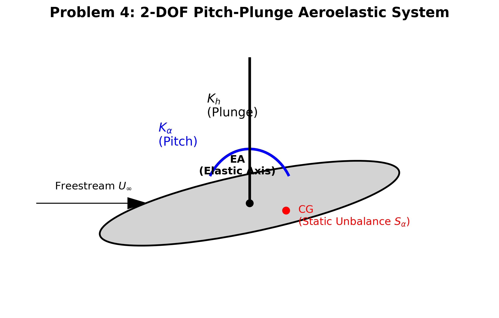
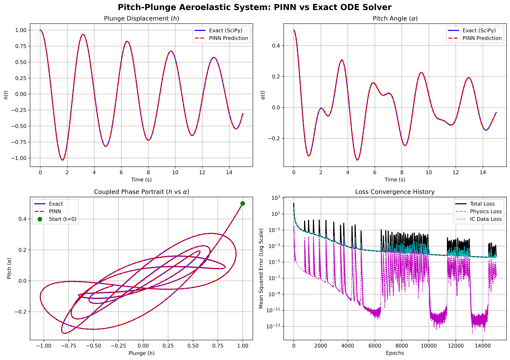

# Problem 4: Pitch-Plunge Aeroelasticity System

This folder contains the PyTorch implementation of a Physics-Informed Neural Network (PINN) designed to solve a system of coupled, 2nd-order Ordinary Differential Equations (ODEs) modeling aircraft wing flight dynamics.

## 📌 Problem Formulation

In aerospace structural dynamics, the classical 2-Degree-of-Freedom (2-DOF) aeroelastic model is used to predict wing flutter. The wing section is modeled with two motions: Plunging ($h$, vertical displacement) and Pitching ($\alpha$, torsional rotation). 

Because the center of gravity (CG) and the elastic axis (EA) of an airfoil are rarely in the exact same location, these two motions are physically coupled by a static unbalance $S_\alpha$. 

**Governing Equations:**
The free response of the wing is governed by the state-space equation $M \ddot{X} + C \dot{X} + K X = 0$, where $X = [h, \alpha]^T$. Expanded, this forms our physics loss residuals:
1. **Plunge Dynamics:** $m \ddot{h} + S_\alpha \ddot{\alpha} + c_h \dot{h} + k_h h = 0$
2. **Pitch Dynamics:** $S_\alpha \ddot{h} + I_\alpha \ddot{\alpha} + c_\alpha \dot{\alpha} + k_\alpha \alpha = 0$

**Parameters Used:**
* Mass Matrix ($M$): $m = 1.0, S_\alpha = 0.2, I_\alpha = 0.5$
* Damping Matrix ($C$): $c_h = 0.1, c_\alpha = 0.1$
* Stiffness Matrix ($K$): $k_h = 4.0, k_\alpha = 5.0$
* Initial Condition: $h(0) = 1.0, \alpha(0) = 0.5$, starting from rest ($\dot{h}=0, \dot{\alpha}=0$).

---

## 📐 Aeroelastic Geometry Schematic
Below is the geometric schematic outlining the physical modeling of the Pitch-Plunge system.

---

## 🧠 Overcoming Failure: Spectral Bias & Fourier Features

During the initial development of this PINN, a standard architecture (Time $t \rightarrow$ Hidden Layers $\rightarrow$ Outputs) was used. The network exhibited a classic failure mode known as **Propagation Failure** and **Spectral Bias**:
1. **Activation Saturation:** As time $t$ increased beyond 3 seconds, the `Tanh` activation functions in the first layer saturated, killing the gradients and causing the network to output flat zeros.
2. **Spectral Bias:** Deep neural networks inherently struggle to learn high-frequency, oscillatory functions. The optimizer found it easier to predict $0.0$ (falsely satisfying the $M(0) + C(0) + K(0) = 0$ physics loss) rather than tracking the complex waves.

### The Solution
To successfully map the 15-second simulation, two state-of-the-art techniques were implemented:
1. **Fourier Feature Embeddings:** The 1D time input was mapped into a high-dimensional space using $\sin(\mathbf{w} t)$ and $\cos(\mathbf{w} t)$, where $\mathbf{w}$ is a frozen matrix of random frequencies. This gave the network a "vocabulary" of high-frequency waves, completely eliminating Spectral Bias.
2. **Initial Condition (IC) Anchoring:** A heavy penalty weight ($100\times$) was applied to the initial condition data loss. This mathematically forced the network to propagate the starting energy forward through the physics equations rather than "cheating" by decaying to zero prematurely.

---

## 📊 Results & Multi-Domain Analysis

Below is the multi-domain evaluation comparing the exact numerical integration (via SciPy's `solve_ivp`) with the PINN's unsupervised physics predictions.

### Key Observations:
1. **Time Domain (Top Row):** The PINN perfectly models the phase shift and damped amplitude decay for both $h(t)$ and $\alpha(t)$ over the entire 15 seconds.
2. **Phase Portrait (Bottom Left):** The $\alpha$ vs $h$ graph plots the coupled energy transfer of the system. The mathematically perfect inward spiral proves the PINN has accurately modeled the physical damping matrix $C$ without the numerical dissipation errors often found in standard forward-Euler solvers.
3. **Loss Convergence (Bottom Right):** The initial condition data loss ($t=0$) drops rapidly to $10^{-13}$, forcing the network to focus purely on satisfying the 2nd-order ODE physics loss, which converges beautifully to $10^{-5}$ as the learning rate scheduler drops the learning rate.

## 📚 References
1. Hodges, D. H., & Pierce, G. A. (2011). *Introduction to Structural Dynamics and Aeroelasticity*. Cambridge University Press.
2. Wang, S., Teng, Y., & Perdikaris, P. (2021). Understanding and mitigating gradient flow pathologies in physics-informed neural networks. *SIAM Journal on Scientific Computing*, 43(5), A3055-A3081.
