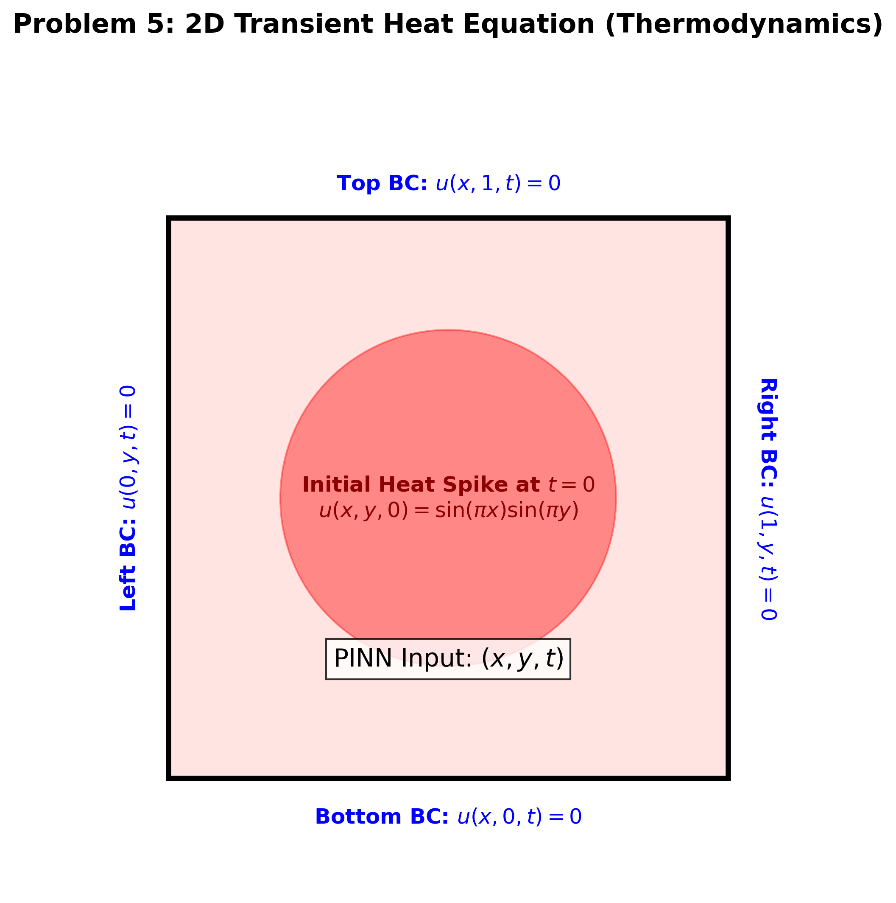
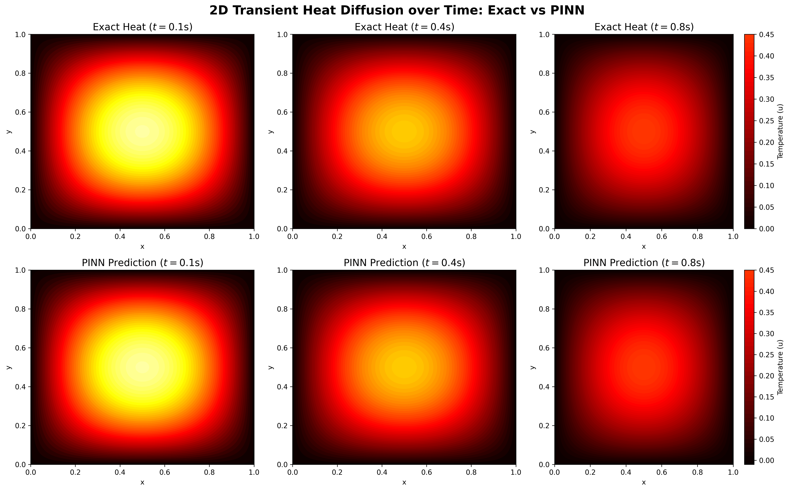

# Problem 5: 2D Transient Heat Equation (Thermodynamics)

This folder contains the PyTorch implementation of a Physics-Informed Neural Network (PINN) designed to solve the 2D Transient Heat Equation.

## 📌 Problem Formulation

The **Heat Equation** is a fundamental parabolic PDE in thermodynamics that models how heat diffuses through a given region over time.

**Governing Equation:**
$$\frac{\partial u}{\partial t} = \alpha \left( \frac{\partial^2 u}{\partial x^2} + \frac{\partial^2 u}{\partial y^2} \right)$$

**Parameters Used:**
* Domain: $x, y \in [0, 1]$, $t \in [0, 1]$
* Thermal Diffusivity ($\alpha$): $\frac{1}{2\pi^2}$
* Initial Condition (Heat Spike): $u(x,y,0) = \sin(\pi x)\sin(\pi y)$
* Boundary Conditions: $u=0$ on all four edges.

---

## 📐 Thermodynamics Geometry Schematic
Below is the schematic outlining the physical modeling of the 2D plate, boundary temperatures, and the initial heat injection.

---

## 🧠 Neural Network & 3D Volumetric Mapping

Scaling up from 1D and 2D problems, this PINN navigates a **3-Dimensional input space simultaneously**: Space $X$, Space $Y$, and Time $T$. 

* **Architecture:** 3 Inputs $(x, y, t) \rightarrow$ 6 Hidden Layers (64 neurons each) $\rightarrow$ 1 Output $(u)$.
* **Double Spatial Derivatives:** The `compute_physics_loss` function utilizes nested `autograd` graphs to calculate the Laplacian operator $(u_{xx} + u_{yy})$ independently across the spatial coordinates, while simultaneously tracking the time decay $u_t$.
* **The "Solid Block" Learning:** Because time is treated as a continuous input dimension rather than a stepped loop (like in standard CFD), the neural network essentially learns the entire 3D block of physics data at once, solving for all space and all time concurrently.

---

## 📊 Results & Diffusion Analysis

Below is the evaluation comparing the exact analytical mathematical decay against the PINN predictions at three different time slices ($t=0.1, 0.4, 0.8$).

### Key Observations:
1. **Accurate Dissipation:** The PINN perfectly matches the exponential decay of the peak temperature as the heat dissipates outward from the center.
2. **Symmetrical Boundary Adherence:** Despite training on completely randomized collocation points throughout the 3D volume, the network maintains perfectly symmetrical $0^\circ$ boundaries on all four edges across all time steps.

## 📚 References
1. Raissi, M., Perdikaris, P., & Karniadakis, G. E. (2019). Physics-informed neural networks: A deep learning framework for solving forward and inverse problems involving nonlinear partial differential equations. *Journal of Computational Physics*, 378, 686-707.
