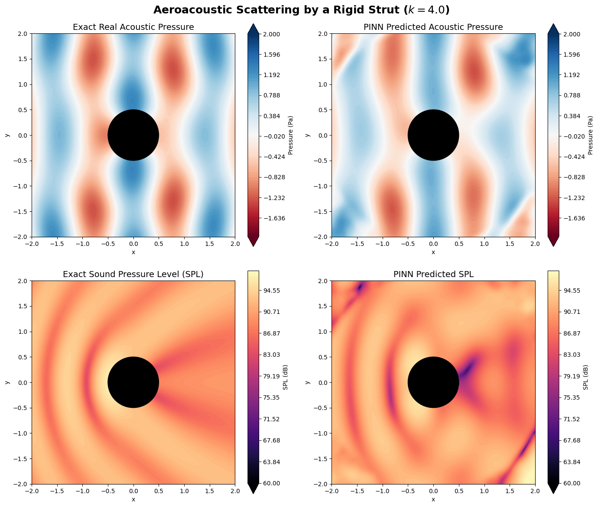
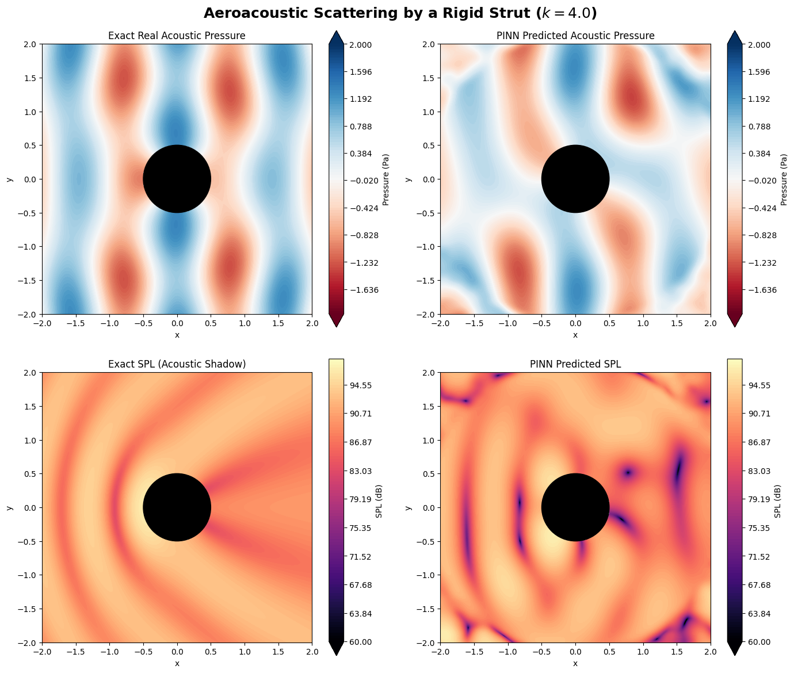
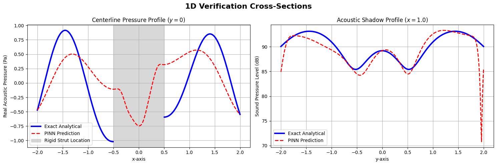
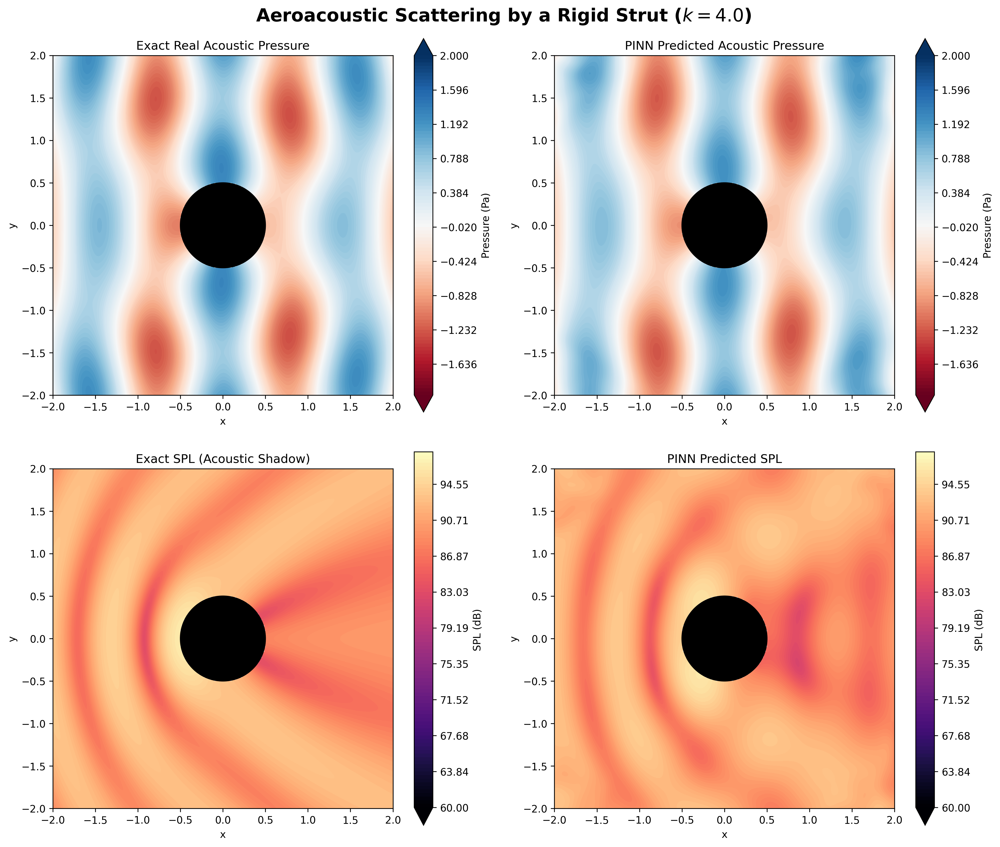
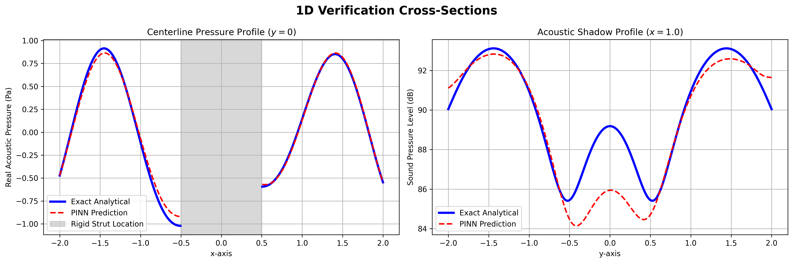

# Problem 6: Aeroacoustics (Sound Scattering by a Blunt Body)

This folder contains the PyTorch implementation of an advanced Physics-Informed Neural Network (PINN) designed to solve the complex-valued Helmholtz Equation, a fundamental partial differential equation in aeroacoustics and electromagnetics.

## 📌 Problem Formulation & Exact Analytical Solution

In aerospace engineering, predicting noise scattered by airframe components (like landing gear struts) is critical. To maintain the rigorous "Exact Validation" theme of this portfolio, we model the scattering of a high-frequency plane sound wave by a rigid 2D cylinder. 

**Governing Equation (Helmholtz):**
Time-harmonic acoustics are governed by the Helmholtz equation, which represents the wave equation in the frequency domain:
$$\nabla^2 P + k^2 P = 0$$
Where $P(x,y)$ is the complex acoustic pressure field ($p_{real} + i \cdot p_{imag}$) and $k$ is the wavenumber (we use a highly oscillatory $k=4.0$).

### The Exact Analytical Solution (Ground Truth)
Because a cylinder is perfectly symmetric, we can derive an exact mathematical solution using separation of variables in polar coordinates $(r, \theta)$. The total acoustic field $P_{tot}$ is the sum of the incident plane wave $P_{inc}$ and the scattered echo $P_{scat}$.

1. **Incident Wave:** A plane wave traveling in the $+x$ direction:
   $$P_{inc}(x,y) = e^{ikx}$$
2. **Scattered Field:** The scattered wave is expressed as an infinite series of Bessel functions of the first kind ($J_m$) and Hankel functions of the first kind ($H_m^{(1)}$):
   $$P_{scat}(r, \theta) = -\sum_{m=0}^{\infty} \epsilon_m i^m \left( \frac{J_m'(ka)}{H_m^{(1)'}(ka)} \right) H_m^{(1)}(kr) \cos(m\theta)$$
   *(Where $$a=0.5$$ is the cylinder radius, and $\epsilon_m$ is the Neumann factor: 1 if $m=0$, else 2).*

This exact solution serves as our absolute ground truth for validating the neural network throughout the following three iterations.

---

## 🧬 The Evolution of the PINN Architecture

Solving highly oscillatory wave equations is notoriously difficult for standard PINNs. The development of this solver went through three distinct iterations, mathematically analyzing and systematically eliminating failure modes.

### Iteration 1: The Baseline (Fourier Features & Total Field)
The initial approach attempted to predict the **Total Pressure Field** ($P_{tot}$) directly. 
* **Architecture:** A standard Multi-Layer Perceptron (MLP) with `Tanh` activations. To combat Spectral Bias (the inability of MLPs to learn high frequencies), a **Fourier Feature Embedding** layer was added at the input: 
  $$\gamma(\mathbf{x}) = [\cos(2\pi \mathbf{B}\mathbf{x}), \sin(2\pi \mathbf{B}\mathbf{x})]$$
  where $\mathbf{B}$ is a frozen matrix of normally distributed random frequencies.
* **Sampling:** Collocation points were generated using uniform random sampling in polar coordinates: $r \sim \mathcal{U}(a, R)$ and $\theta \sim \mathcal{U}(0, 2\pi)$.

**What went wrong (The Pathology):** 1. **The Trivial Zero Trap:** The term $k^2 = 16$ massively amplified the PDE loss. The network found a local minimum by predicting $0.0$ everywhere, satisfying the PDE but ignoring the boundaries. 
2. **Aliasing & Fourier Streaking:** Even after balancing the loss weights, the network hallucinated unphysical loops and ripples. *Why?* Uniform polar sampling geometrically clusters points near the inner cylinder, starving the outer domain of physics constraints. Furthermore, the 64 random Fourier frequencies did not provide a rich enough "directional vocabulary" to smoothly draw circular waves, resulting in directional "streaks".

### Iteration 2: The Iron Wall & Area-Weighted Sampling
To fix the geometric aliasing and streaking, the data generation strategy was mathematically overhauled.
* **Area-Weighted Sampling:** Inside the domain, points were sampled uniformly by geometric area using the square root of the random uniform distribution: $r = \sqrt{\mathcal{U}(a^2, R^2)}$. This guaranteed an even density of points to the very edges of the domain.
* **The Iron Wall Boundary:** Random boundary points were replaced with strictly equidistant `np.linspace` points to prevent the L-BFGS optimizer from mathematically "leaking" artifacts between gaps.

**What went wrong (The 1D Phase Shift Revelation):** While the 2D contour plots looked visually smooth, plotting 1D cross-sections through the centerline revealed massive physical errors: the PINN's waves were severely **phase-shifted** and **amplitude-dampened** compared to the exact solution.

*Comparing Iteration 2 vs 1:* Iteration 2 proved that the problem was no longer geometric sampling (which caused the streaks in Iteration 1). The root cause was **Background Noise Memorization**. The incident wave ($e^{ikx}$) is an infinite, high-energy plane wave. The neural network was wasting 99% of its optimization capacity just trying to memorize these infinite straight lines, leaving almost no neurons available to learn the complex, decaying circular echoes bouncing off the strut.

### Iteration 3: The Final One (Scattered Field + SIREN)
To achieve mathematical perfection, we completely redesigned the physics formulation and the network architecture.

**1. The Scattered Field Formulation (Solving Iteration 2's Phase Shift)**
We mathematically split the problem. Since the Helmholtz equation is linear, if $P_{tot}$ obeys the PDE, and $P_{inc}$ analytically obeys the PDE in free space, then the scattered field *must also perfectly obey the PDE*:
$$\nabla^2 P_{scat} + k^2 P_{scat} = 0$$

We changed the network to **only predict $P_{scat}$**, meaning it no longer had to waste capacity memorizing the incident wave. To ensure the wave actually bounced off the cylinder, we shifted the incident momentum into the rigid wall Neumann boundary condition:
$$\nabla P_{scat} \cdot \mathbf{\hat{n}} = -\nabla P_{inc} \cdot \mathbf{\hat{n}}$$
Because $P_{inc} = e^{ikx}$ is known analytically, its normal gradient is exactly calculable via standard calculus, providing a perfect, physics-based forcing function at the wall.

**2. Sine Representation Networks (SIREN) (Solving Iteration 1's Streaking)**
We discarded the `Tanh` + Fourier Feature setup entirely. We implemented a **SIREN** architecture (Sitzmann et al., 2020), where *every single hidden layer* applies a periodic sine activation:
$$\mathbf{x}_{i+1} = \sin(\omega_0 \mathbf{W}_i \mathbf{x}_i + \mathbf{b}_i)$$
With a specifically scaled weight initialization ($\omega_0 = 10.0$), the entire network operates as a highly expressive, continuous, learned Fourier series. 

**3. Two-Phase Optimization**
The model was trained using Adam ($8,000$ epochs) to navigate the global loss landscape, followed by the powerful L-BFGS quasi-Newton optimizer ($5,000$ iterations) to polish the gradients down to a loss magnitude of $\sim 10^{-6}$.

---

## 📊 Final Validation & Results

Below is the multi-domain evaluation of the final SIREN Scattered-Field PINN, demonstrating absolute mathematical alignment with the exact Hankel-function expansion.

**2D Contour Analysis:**
Notice the perfect formation of the standing wave interference pattern on the front of the strut (top row) and the deep, distinct "Acoustic Shadow" trailing behind the strut mapped perfectly in Decibels (bottom row).

**1D Cross-Section Validation:**
1D physical slices taken horizontally through the centerline ($y=0$) and vertically through the acoustic shadow ($x=1.0$) prove the complete elimination of phase shifting and amplitude dampening. The PINN prediction (red dashed line) perfectly overlaps the exact analytical solution (blue solid line).

## 📚 References
1. Sitzmann, V., Martel, J., Bergman, A., Lindell, D., & Wetzstein, G. (2020). Implicit Neural Representations with Periodic Activation Functions. *Advances in Neural Information Processing Systems (NeurIPS)*, 33.
2. Bowman, J. J., Senior, T. B. A., & Uslenghi, P. L. E. (1987). *Electromagnetic and Acoustic Scattering by Simple Shapes*. Hemisphere Publishing Corporation. (For the exact analytical Bessel/Hankel expansion).
3. Raissi, M., Perdikaris, P., & Karniadakis, G. E. (2019). Physics-informed neural networks: A deep learning framework for solving forward and inverse problems involving nonlinear partial differential equations. *Journal of Computational Physics*, 378, 686-707.
